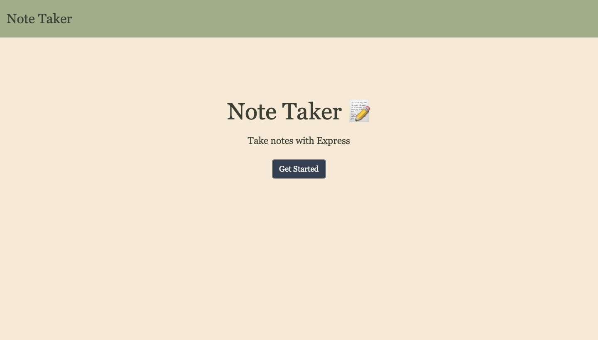
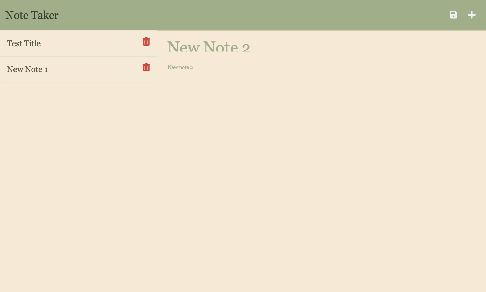

# expressjs-note-taker
An app for taking notes with Express JS


## Description

This project uses npm, express, path, uuid, fs, andjavascript to generate a Note Taking app. By using api routers, each user input-generated note can be stored into a JSON database using POST route handlers and rewritten onto the webpage by retrieving the data with GET route handlers. All of this information is written into the software with the fs writing system. Furthermore, using uuids, each note can be assigned a unique id and filtered to use the delete functionality. These filtered notes (excluding the note selected for deletion) can be rewritten onto the page using the fs system again. This webpage was created using modular routers and, while not completely necessary for this app, it allowed me to practice concepts I struggled with and to deeply comment my code for future study.

<!-- Provide a short description explaining the what, why, and how of your project. Use the following questions as a guide:

- What was your motivation?
- Why did you build this project? (Note: the answer is not "Because it was a homework assignment.")
- What problem does it solve?
- What did you learn? -->

## Table of Contents (Optional)

<!-- If your README is long, add a table of contents to make it easy for users to find what they need. -->

- [Installation](#installation)
- [Usage](#usage)
- [Credits](#credits)
- [License](#license)
- [Badges](#badges)
- [Features](#features)
- [Tests](#tests)

## Installation

There is no installation required for this application. Simply follow this [link](https://expressjs-note-taker-ald.herokuapp.com), open in your preferred browser, and begin taking some notes!
<!-- What are the steps required to install your project? Provide a step-by-step description of how to get the development environment running. -->


## Usage

There are 10 main sections of this repository:

- [db Folder](https://github.com/abbeydoyle/expressjs-note-taker/tree/main/db) - Contains the json database file for each note

- [helpers Folder](https://github.com/abbeydoyle/expressjs-note-taker/tree/main/helpers) - Contains fsUtils.js file encoding the read and write utility helper functions

- [Public Folder](https://github.com/abbeydoyle/expressjs-note-taker/tree/main/public) - Contains the starter code with the index.html and notes.html webpages, the initial javascript functions, and the webpage css

- [Notes Folder](https://github.com/abbeydoyle/expressjs-note-taker/tree/main/notes) - Contains a text file for the graveyard text file and the webpage images

- [Routes Folder](https://github.com/abbeydoyle/expressjs-note-taker/tree/main/routes) - Contains [notes.js](https://github.com/abbeydoyle/expressjs-note-taker/blob/main/routes/notes.js), encoding all the routers, and [index.js](https://github.com/abbeydoyle/expressjs-note-taker/blob/main/routes/index.js), the modular routing file

- [gitignore](https://github.com/abbeydoyle/expressjs-note-taker/blob/main/.gitignore) - Contains all files to be ignored in the Github repository

- [License](https://github.com/abbeydoyle/expressjs-note-taker/blob/main/LICENSE) - Contains the webpage license

- [ReadMe](https://github.com/abbeydoyle/expressjs-note-taker/blob/main/README.md) - This file containing an executive overview of the project

Generated Webpage: [https://expressjs-note-taker-ald.herokuapp.com](https://expressjs-note-taker-ald.herokuapp.com)





<!-- Provide instructions and examples for use. Include screenshots as needed.

To add a screenshot, create an `assets/images` folder in your repository and upload your screenshot to it. Then, using the relative filepath, add it to your README using the following syntax:

    ```md
    
    ``` -->

## Credits

This webpage was built using UW Trilogy Bootcamp class materials as references.


## License

MIT License

Copyright (c) 2022 abbeydoyle

Permission is hereby granted, free of charge, to any person obtaining a copy of this software and associated documentation files (the "Software"), to deal in the Software without restriction, including without limitation the rights to use, copy, modify, merge, publish, distribute, sublicense, and/or sell copies of the Software, and to permit persons to whom the Software is furnished to do so, subject to the following conditions:

The above copyright notice and this permission notice shall be included in all copies or substantial portions of the Software.

THE SOFTWARE IS PROVIDED "AS IS", WITHOUT WARRANTY OF ANY KIND, EXPRESS OR IMPLIED, INCLUDING BUT NOT LIMITED TO THE WARRANTIES OF MERCHANTABILITY, FITNESS FOR A PARTICULAR PURPOSE AND NONINFRINGEMENT. IN NO EVENT SHALL THE AUTHORS OR COPYRIGHT HOLDERS BE LIABLE FOR ANY CLAIM, DAMAGES OR OTHER LIABILITY, WHETHER IN AN ACTION OF CONTRACT, TORT OR OTHERWISE, ARISING FROM, OUT OF OR IN CONNECTION WITH THE SOFTWARE OR THE USE OR OTHER DEALINGS IN THE SOFTWARE.

<!-- The last section of a high-quality README file is the license. This lets other developers know what they can and cannot do with your project. If you need help choosing a license, refer to [https://choosealicense.com/](https://choosealicense.com/). -->

---

<!-- 🏆 The previous sections are the bare minimum, and your project will ultimately determine the content of this document. You might also want to consider adding the following sections. -->

## Badges


<!-- 

Badges aren't necessary, per se, but they demonstrate street cred. Badges let other developers know that you know what you're doing. Check out the badges hosted by [shields.io](https://shields.io/). You may not understand what they all represent now, but you will in time. -->

## Features

This page features:

- Delete option
- Linked navbar
- Heroku deployment
- Cards updated based on note entry
- Notes that persist upon refresh


<!-- If your project has a lot of features, list them here. -->

<!-- ## How to Contribute

If you created an application or package and would like other developers to contribute it, you can include guidelines for how to do so. The [Contributor Covenant](https://www.contributor-covenant.org/) is an industry standard, but you can always write your own if you'd prefer. -->

## Tests

- Select the "Get Started" button to begin taking your notes!
- At any point, click the "Note Taker" text located in the navbar to return to the homepage
- Notice that you will not receive the option to save unless you've typed both title and text into your new note
- Delete any note you no longer need!
<!-- Go the extra mile and write tests for your application. Then provide examples on how to run them here. -->